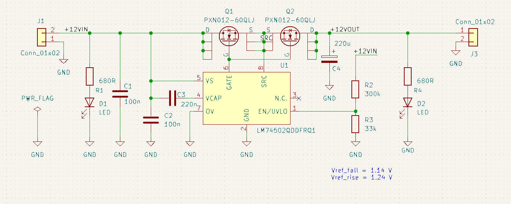
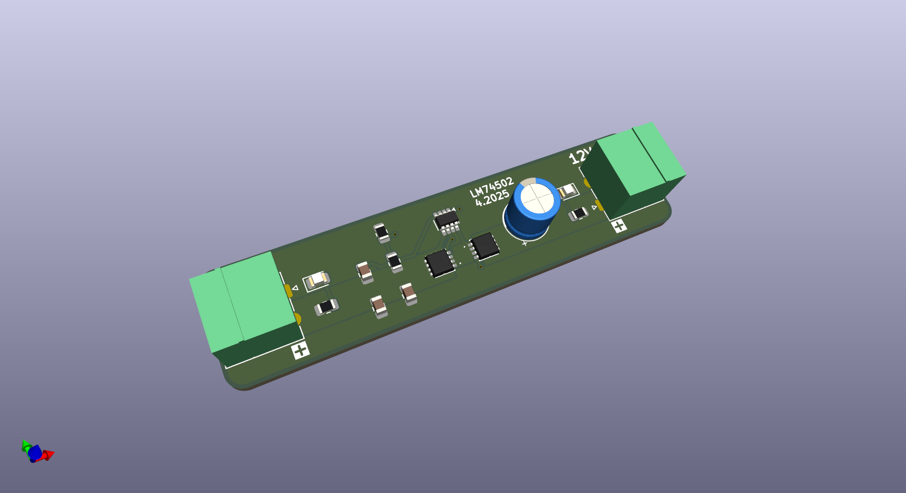

# 12V Battery disconnector

As my first contribution to GitHub, I’m sharing a simple and budget-friendly battery disconnector circuit primarily intended for a 12V Lead-Acid car battery.

The project folder includes:
- `.kicad_pro`, `.kicad_pcb`, and `.kicad_sch` files  
- Gerber files for fabrication
- BOM file

The design is based on the **Texas Instruments LM4052** IC.

The circuit disconnects the battery when the voltage drops below 11.5V. Due to built-in hysteresis, it reconnects only when the voltage goes back up to 12.5V

## Schematic and 3D view

Circuit schematic is shown below:

It uses two Phoenix Contact connectors and two LEDs for indicating when input/output is present.

Only the undervoltage function of the LM4052 is used. As explained in the datasheet, it has fixed hysteresis for the battery voltage. The trigger level is set by a resistor divider connected to the UVLO pin.

There are two NMOS transistors that act as a load switch and also provide reverse polarity protection. The gate driver pin includes inrush current control, which further simplifies the design.

Also included: a 200nF charge pump capacitor, plus input and output electrolytic caps.

The 3D view of the board is shown below:

